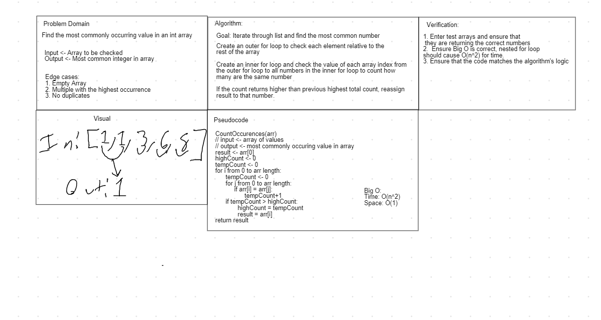

# Lab 03 - System.IO

*Author: Nicco Ryan*

----

## Description
This is a console application made to solve several code challenges with a very basic UI.
---

### Getting Started
Clone this repository to your local machine.

```
$ git clone https://github.com/Niccoryan0/Lab02-UnitTests-Documentation.git
```

### To run the program from Visual Studio:
Select ```File``` -> ```Open``` -> ```Project/Solution```

Next navigate to the location you cloned the Repository.

Double click on the ```Lab02-UnitTests``` directory.

Then select and open ```Lab02-UnitTests.sln```

---

### Visuals
#### Application in Action



---

### Change Log
1.0: *Initial release* - 8 July 2020